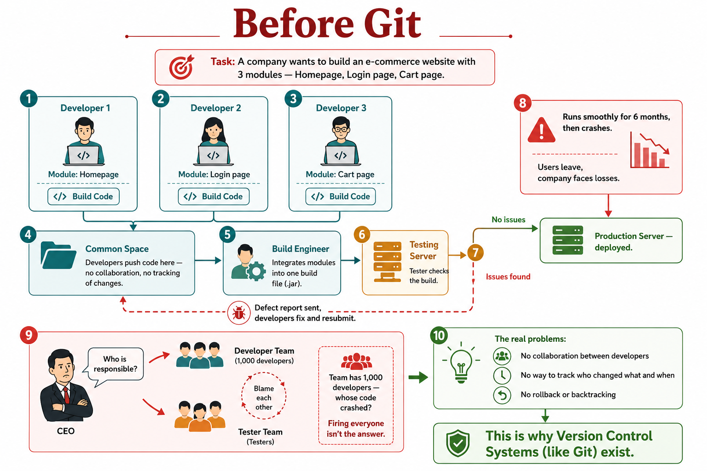
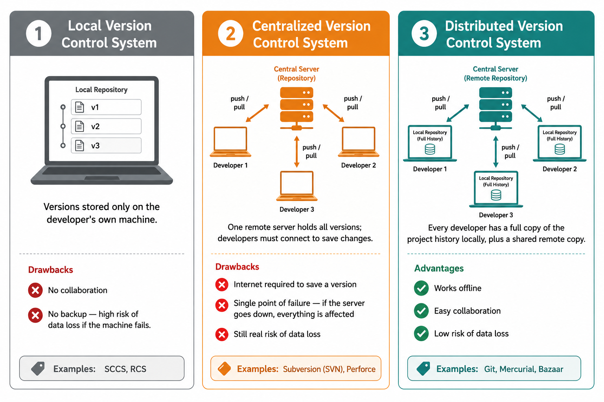
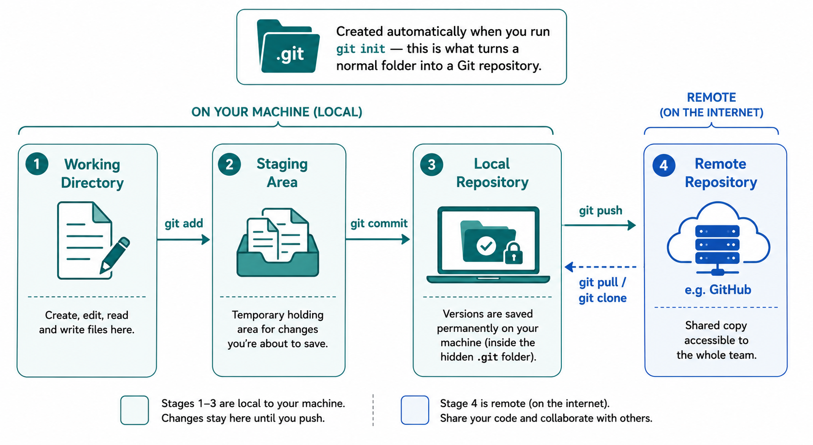

## Why does Git (version control) exist?



Imagine a company building an e-commerce site with three modules —  **Homepage**, **Login page**, and **Cart page** — split across three 
developers.

1. Each developer builds their module separately, with no coordination.
2. All three push their code to a shared folder (**common space**) —  nobody tracks who changed what, or when.
3. A build engineer manually merges everything into one build file (`.jar`).
4. A tester checks the build on a separate testing server.
5. If bugs are found, a defect report goes back to the developers, who fix the issue and resubmit — restarting the whole loop.
6. Once testing passes, the application is deployed to production.

It runs fine for **six months** — then it crashes. Users leave, and the company takes a financial hit.

The CEO wants to know why. The developer team and the tester team blame each other. And here's the real problem: the developer team has **1,000 people**. Nobody can prove whose code caused the crash. Firing the entire team obviously isn't the answer — but without any way to trace changes, there's no way to hold anyone accountable either.

### The underlying issues

- **No collaboration** between developers working on interdependent modules
- **No way to track** who changed what, and when
- **No backtracking or rollback** to a known-good version

This is exactly the gap a **version control system** fills: it tracks  every change, attributes it to a person and a timestamp, lets teams collaborate on the same codebase without stepping on each other, and makes it possible to roll back to any earlier state. That's why Git exists.

## What is a version control system?

A version control system (VCS) helps you manage and track changes to  your source code over time. Every time you save a meaningful change to a file, that's treated as a new **version**. A VCS keeps a history of all these versions so you can see what changed, who changed it, and go back to an earlier version if something breaks.

### Types of version control systems




**1. Local Version Control System**
Versions are stored only on the developer's own machine — there's no shared history and no backup elsewhere.
- ❌ No collaboration between developers
- ❌ High risk of losing everything if the machine fails
- Examples: SCCS, RCS

**2. Centralized Version Control System**
One remote server holds the full version history. Developers connect to it to save ("push") and retrieve ("pull") versions — nothing is  tracked on their local machine by default.
- ❌ Requires an internet connection to save a version
- ❌ Single point of failure — if the server goes down, so does 
  everyone's access
- ❌ Still carries meaningful risk of data loss
- Examples: Subversion (SVN), Perforce

**3. Distributed Version Control System**
Every developer has a complete copy of the project's history on their own machine, in addition to a shared copy on a remote server.
- ✅ Works offline — you can save versions locally and push them later
- ✅ Easy collaboration since everyone has the full history
- ✅ Low risk of data loss, since the history exists in many places
- Examples: Git, Mercurial, Bazaar

### Why Git specifically?

Git is a **distributed version control system** created by **Linus Torvalds in 2005**. It's often expanded to "Global Information 
Tracker" as a popular (if informal) backronym. Git tracks three key things for every change:
- **Who** made the change
- **What** changed
- **When** it changed

Git itself lives on each developer's machine. **GitHub** (along with GitLab, Bitbucket, and others) is a *hosting service* for Git repositories — it's not Git itself, just the most common place to keep a shared remote copy of your repository.

## Installing Git

### Windows
1. Download the installer from [git-scm.com](https://git-scm.com/download/win).
2. Run the installer and accept the default options (safe for beginners).
3. Verify the install by opening Command Prompt or Git Bash and running:
```bash
   git --version
```

### macOS
Option 1 — using Homebrew (recommended):
```bash
brew install git
```

### Linux (Debian/Ubuntu)
```bash
sudo apt update
sudo apt install git
```

### Linux (Fedora)
```bash
sudo dnf install git
```

### After installing — set your identity
Git needs to know who's making the changes, since this is what gets 
recorded with every commit:
```bash
git config --global user.name "Your Name"
git config --global user.email "your.email@example.com"
```

Confirm everything is set correctly:
```bash
git config --list
```


### Git's working stages



Once Git is initialized in a folder (`git init`), it creates a hidden 
`.git` folder and splits your workflow into three local stages:

1. **Working directory** — where you create, edit, and read/write files 
   normally.
2. **Staging area** — a temporary holding area for the changes you're 
   about to save (`git add` moves files here).
3. **Local repository** — where versions are saved permanently on your 
   machine (`git commit` saves them here).

A fourth, optional stage is the **remote repository** (e.g. on GitHub), 
which you sync with using `git push` and `git pull`.
