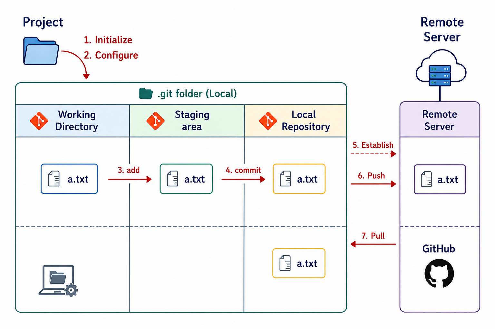
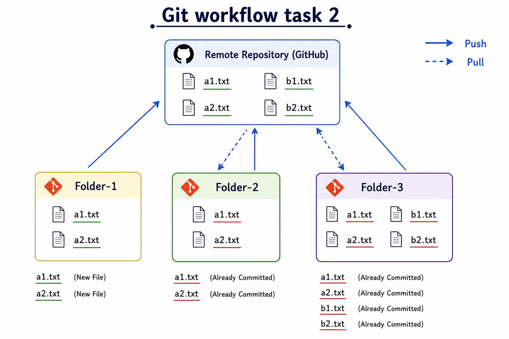

# Git workflow

This section walks through the core Git commands in the order you'll actually use them — from setting up a repository to pushing your work to GitHub — followed by two hands-on tasks to practice them.



## 1. Initialize a repository

Before you can use Git in a folder, you need to tell Git to start tracking it.

```bash
git init
```

This creates a hidden `.git` folder in the current directory. That hidden folder *is* the repository — it's where Git stores your entire version history.

## 2. Configure your identity

Git needs to know who's making changes, since this gets recorded with every commit.

```bash
git config user.name "your-username"
git config user.email "your-email@example.com"
```

> Use `--global` after `config` (e.g. `git config --global user.name "..."`) if you want this identity applied to every repository on your machine, not just the current one.

To check everything you've configured:

```bash
git config --list
```

To check just the username or email:

```bash
git config user.name
git config user.email
```

## 3. Add — move files to the staging area

Copying files from the working directory into the staging area is called **adding**.

```bash
git add filename          # add one specific file
git add file1 file2 file3 # add multiple specific files
git add .                 # add everything in the working directory
git add *.extension        # add all files with a specific extension
```

To check whether a file is sitting in the working directory (untracked) or the staging area (tracked and ready to commit):

```bash
git status
```

- Files listed in **red** → untracked, still in the working directory.
- Files listed in **green** → tracked, currently in the staging area.

## 4. Commit — save to the local repository

Moving files from the staging area into the local repository — saving them as a permanent version — is called **committing**.

```bash
git commit -m "added my first project"
```

The `-m` flag lets you attach a message describing the change, right from the command line.

To review your commit history:

```bash
git log            # full history, one entry per commit
git log --oneline  # condensed history, one line per commit
```

## 5. Connect to a remote repository

To link your local repository to a remote one (like a repository on GitHub):

```bash
git remote add origin <GitHub_repository_url>
```

`origin` is just an alias — a short name that points to that URL, so you don't have to type the full URL every time.

```bash
git remote -v              # verify the connection (shows the alias and URL)
git remote remove origin   # remove the connection
```

## 6. Push — upload local commits to the remote

```bash
git push origin master
# or, if your default branch is named "main"
git push origin main
```

## 7. Pull — download remote changes to your local repository

```bash
git pull origin master
# or
git pull origin main
```

---

## Task 1 — Add and commit multiple files

1. Create a new folder and initialize it as a Git repository.
2. Create 5 files with a `.html` extension.
3. Add the files to the staging area and verify with `git status`.
4. Commit each file **separately** (five separate commits).
5. Establish a connection to a remote repository on GitHub.
6. Push all the files to the remote repository.

## Task 2 — Push, pull, and the fast-forward problem


**Setup:** create 3 folders — `Folder1`, `Folder2`, `Folder3`.

**Inside Folder1:**
1. Initialize a local repository.
2. Create 2 files, `a1.txt` and `a2.txt`, and add them to the staging area.
3. Commit them separately.
4. Create a repository on GitHub and connect Folder1's local repository to it.
5. Push both files to the GitHub repository.

Refresh the repository page on GitHub — you should see `a1.txt` and `a2.txt` there.

**Inside Folder2:**
1. Initialize a local repository.
2. Connect it to the same GitHub repository.
3. Pull `a1.txt` and `a2.txt` from the remote into this local repository.
4. Verify the files are now present locally.

**Inside Folder3:**
1. Initialize a local repository.
2. Create 2 files, `b1.txt` and `b2.txt`, and add them to the staging area.
3. Commit them separately.
4. Connect it to the same GitHub repository.
5. Push the files, then try to pull.

You'll hit an error here:

```
To https://github.com/username/Git_Workflow_Task-2.git
 ! [rejected]        master -> master (non-fast-forward)
error: failed to push some refs to 'https://github.com/username/Git_Workflow_Task-2.git'
hint: Updates were rejected because the tip of your current branch is behind
hint: its remote counterpart. If you want to integrate the remote changes,
hint: use 'git pull' before pushing again.
hint: See the 'Note about fast-forwards' in 'git push --help' for details.
```

**Why this happens:** the commit history in Folder3's local repository doesn't include the commits that already exist on the remote (the `a1.txt` / `a2.txt` commits pushed from Folder1). Git refuses to push because doing so would overwrite history it doesn't recognize. Before pushing new commits, your local history has to include — or "catch up with" — whatever is already on the remote.

### The golden rule

1. **Pull** the changes from the remote server first.
2. Let your local history **match** the remote's, so the two are in sync.
3. **Then** push your new commits.

### Resolving it — Folder4

1. Create a new folder, `Folder4`.
2. Initialize a local repository.
3. Create 2 files, `b1.txt` and `b2.txt`, and add them to the staging area.
5. Connect it to the same GitHub repository.
6. Pull the changes from remote server(Github repository) to the local repository to match the commit history
(if you type ls you can see the a1.txt and a2.txt files in this folder)
7. Now Commit b1.txt and b2.txt  separately.
8. push the files — this time it should succeed.
