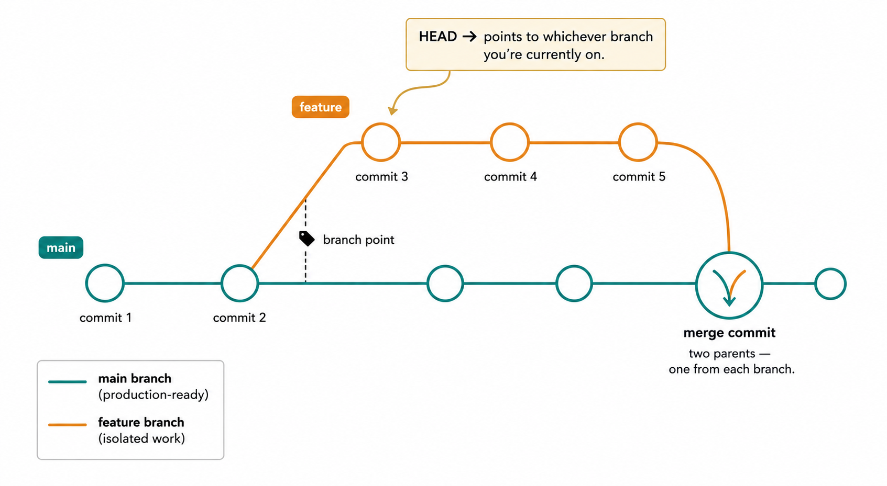
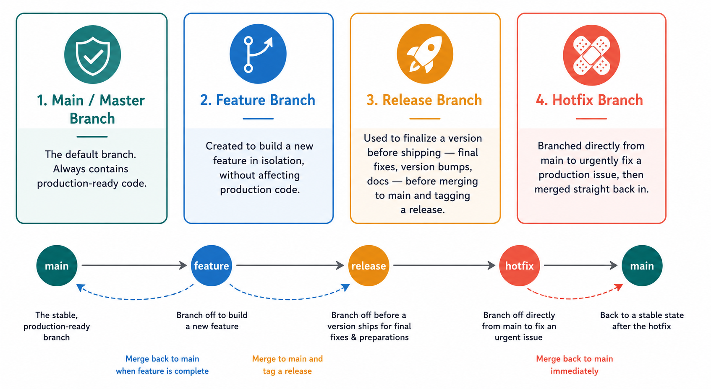

# Branching



Branching means creating a separate path — a separate line of commits — off the main line of development, so you can work independently without disturbing the original code.

A branch is just a lightweight, movable pointer to a specific commit. That's why creating one is instant, unlike copying an entire folder: Git isn't duplicating files, it's just adding a new named pointer.

## HEAD

**HEAD** is Git's pointer to "where you currently are." Normally, HEAD points to a branch, and that branch points to its latest commit. When you switch branches, Git moves HEAD to point at the new branch instead. (If HEAD ever points directly at a commit instead of a branch, you're in what's called a "detached HEAD" state — outside the scope of this note, but good to recognize if you see the term.)

## Types of branches

**1. Master / main branch**
The default branch, created automatically when you make your first commit. It always contains production-ready code.

**2. Feature branch**
Branched off to build a new feature, in isolation from the main line, without risking the stability of production code.
It is used to introduced new feature to the application.

**3. Release branch**
Cut from the main line to finalize a version before it ships — final bug fixes, version bumps, documentation updates — before merging back into main and tagging it as a release.

**4. Hotfix branch**
Created directly from main to fix an urgent, immediate issue in production. Once fixed, it's merged back in so the fix ships as fast as possible.

> These four branch types closely resemble a well-known branching model called **Git Flow**, which additionally uses a `develop` branch sitting between `main` and `feature` branches. You don't need Git Flow to use branches effectively, but it's worth recognizing the name if you come across it later.

## Commands

**List branches**
```bash
git branch          # local branches
git branch --list   # same as above
git branch -r       # remote branches only
git branch -a       # both local and remote
git branch -v       # local branches with their latest commit
```

**Create a branch**
```bash
git branch branchname
```

**Switch to a branch**
```bash
git switch branchname
# or
git checkout branchname
```
> `git switch` was introduced in Git 2.23 to do just one job — switching branches. `git checkout` is older and does several unrelated things (switching branches *and* restoring files), which is why `switch` is the clearer, safer choice going forward. Both still work.

**Create and switch in one step**
```bash
git checkout -b branchname
# or, the newer equivalent
git switch -c branchname
```

**Push a branch to the remote**
```bash
git push origin branchname
```

**Pull a branch from the remote**
```bash
git pull origin branchname
```

**Merge a branch into your current branch**
```bash
git merge branchname
```
Run this while on the branch you want to merge *into* (usually `main`). This is how changes made on a feature branch actually make it back to the main line.

**Delete a branch**
```bash
git branch -d branchname   # safe delete — only works if the branch is fully merged
git branch -D branchname   # force delete — deletes even if unmerged
git push origin --delete branchname   # delete a branch on the remote
```

**Visualize branch history**
```bash
git log --oneline --graph --all
```
Shows all branches and how their commit histories diverge — very useful for seeing exactly what the task below demonstrates.

---

## Task — see how branches isolate history

1. Initialize a local repository.
2. Create 3 files — `a1.txt`, `a2.txt`, `a3.txt` — and add them to the staging area.
3. Commit them **separately** on the main branch.
4. Create a feature branch and switch to it.
5. Create 2 files — `x1.txt`, `x2.txt` — and commit them separately.
6. Check the commit log on the feature branch (`git log --oneline`).
   - You'll see **all** the commits from the main branch, plus the two new ones from `x1.txt` and `x2.txt`.
7. Switch back to the main branch and check the commit log again.
   - You will **not** see the commits for `x1.txt` or `x2.txt` — they only exist on the feature branch.
8. Merge both the branches using (`git merge branchname`).
Now you will be able to see all the commit logs and files on the master branch also.

### What this demonstrates

- A new branch starts out **containing everything the branch it was created from had** — all files and commits present on main at the time of branching carry over to the feature branch.
- From that point on, the two branches diverge: commits made on the feature branch stay isolated there. They will **not** appear on main unless you explicitly run `git merge` to bring them in.
- If you try to create and switch to a branch before making any commit at all on main, you'll get an error — Git needs at least one commit to point a new branch at.
- `master`/`main` being the "default" branch name is just a convention, not a rule — it's simply whichever branch your first commit happens to land on. You can rename it (`git branch -m newname`) or configure Git to use a different default name for new repositories.
